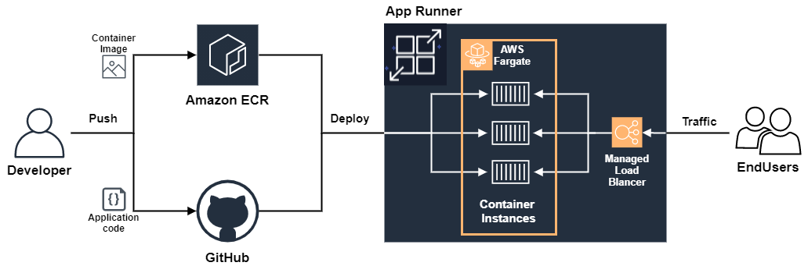
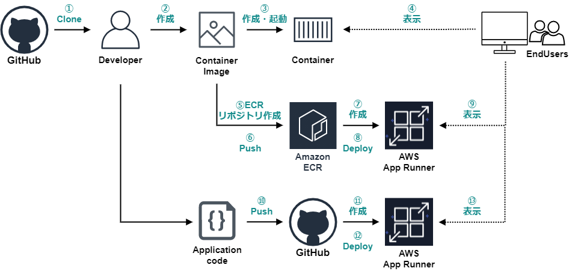
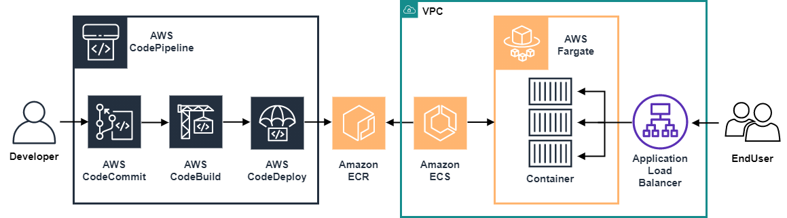

# 面倒臭いことはもうしない！ AWS App RunnerでWebアプリを爆速でデプロイ！

## 事前準備
- Dockerインストール
- GitHubアカウント
- AWSアカウント

## 今回の流れ
App Runnerを活用して、アプリケーションを実際にデプロイします。
  
大きな流れとしては、次の2パターンを実施します。
- コンテナレジストリパターン
- ソースコードリポジトリパターン

### 技術要素
- [AWS AppRunner](https://aws.amazon.com/jp/apprunner/)
- [Amazon Elastic Container Registry: ECR](https://aws.amazon.com/jp/ecr/)
- [Docker](https://www.docker.com/)
- [Node.js](https://nodejs.org/ja/)
- [p5.js](https://p5js.org/)

## 手順
全体手順としては次の流れで進めます。
  
- ①デモアプリクローン
- ②③④デモアプリ動作確認
- ⑤⑥⑦⑧⑨コンテナレジストリパターン(Amazon ECRパターン)
- ⑩⑪⑫⑬ソースコードリポジトリパターン(GitHubパターン)
- ゴミ掃除

## 注意事項

App Runnerでは、まだ制限が多くあります。  
利用する際は、事前に制限内容を確認の上、検討をお願いします。  
ご参考までにロードマップ等ご確認ください。  
[App Runner - ロードマップ](https://github.com/aws/apprunner-roadmap)  

---

今回は次のCodeDeploy等を利用したパターンは実施しません。  
  

---

Windows/Macの方向けに作成しております。  
コマンドラインツールは、個々の利用しているもので良いのですが、今回の手順は次のものを利用します。  
- Windows：コマンドプロンプト
- Mac：ターミナル
