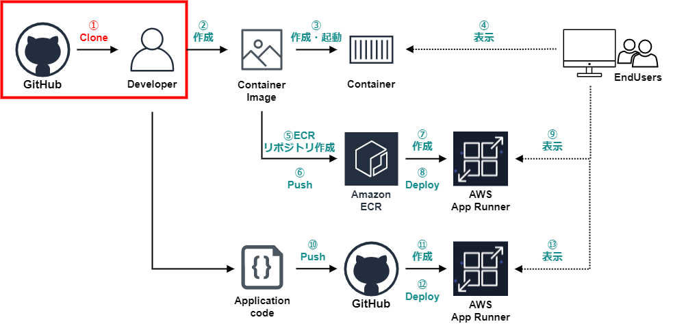

# デモアプリクローン
この手順では次の手順を進めていきます。  
  
## Githubリポジトリ表示
次のリンクよりデモアプリがあるGitHubリポジトリにアクセスします。  
URL:https://github.com/miracleave-ltd/meet-up-20_app-runner  
  

## リポジトリコピー
Forkボタンをクリックします。  
  
※Forkボタンをクリック後、Githubにログインしている方は自動で自分のリポジトリに遷移します。

## クローン用URL取得
自分のリポジトリにコピーされたアプリのURLをコピーします。  
  

## アプリクローン
以下の操作を行い、GitHubよりアプリを取得します。 

例：Desktopにクローンする場合(Windowsの型はスキップしてください。)
```
cd ~/Desktop
```

アプリをクローンします。  
GitHubよりコピーしたURLを使用してください。  
```
git clone [コピーしたURL] 
```

最終行に`done.`が表示されれば、完了です。  

> Cloning into 'meet-up-20_app-runner'...  
> remote: Enumerating objects: 363, done.  
> remote: Counting objects: 100% (363/363), done.  
> remote: Compressing objects: 100% (289/289), done.  
> remote: Total 363 (delta 78), reused 329 (delta 54), pack-reused 0  
> Receiving objects: 100% (363/363), 8.38 MiB | 24.38 MiB/s, done.  
> Resolving deltas: 100% (78/78), done.  
