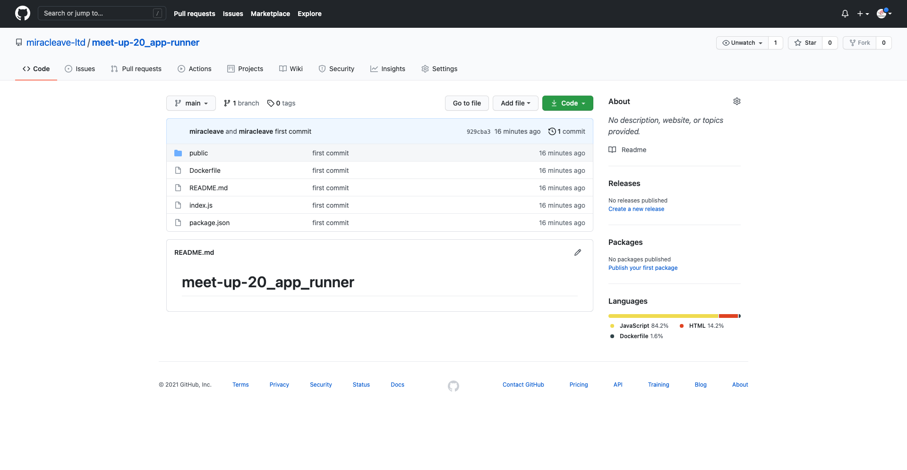
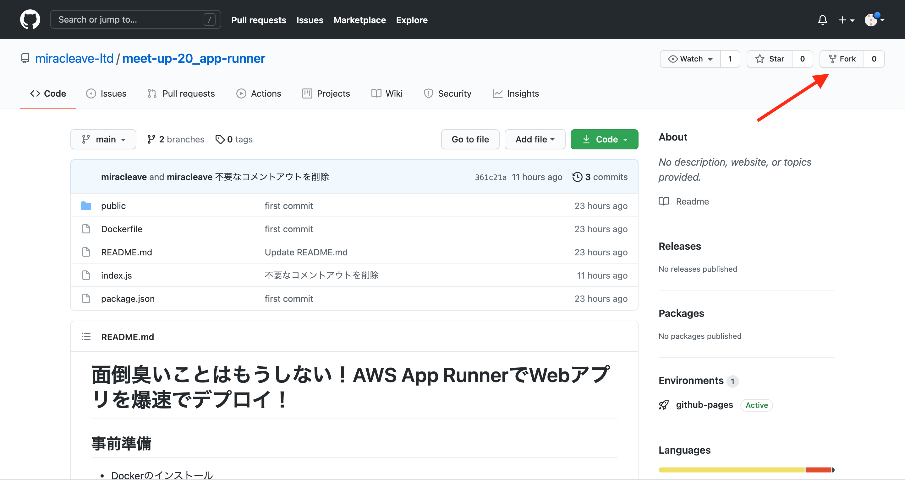
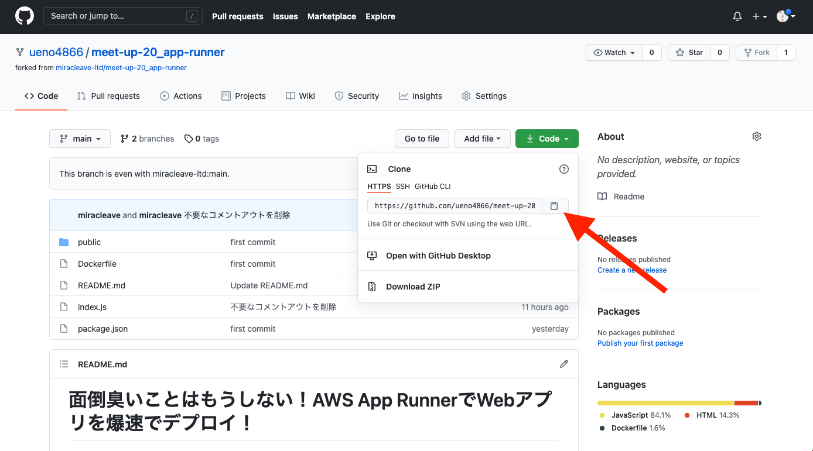

# デモアプリクローン
## Githubリポジトリ表示
次のリンクよりデモアプリがあるGitHubリポジトリにアクセスします。  
URL:https://github.com/miracleave-ltd/meet-up-20_app-runner  
  

## リポジトリコピー
Forkボタンをクリックします。  
  
※Forkボタンをクリック後、Githubにログインしている方は自動で自分のリポジトリに遷移します。
## クローン用URL取得
自分のリポジトリにコピーされたアプリのURLをコピーします。  
  
## アプリクローン
以下の操作を行い、GitHubよりアプリを取得します。  

例：Desktopにクローンする場合
```
~ $ cd ~/Desktop
~/Desktop $ git clone [コピーしたURL] 
```
