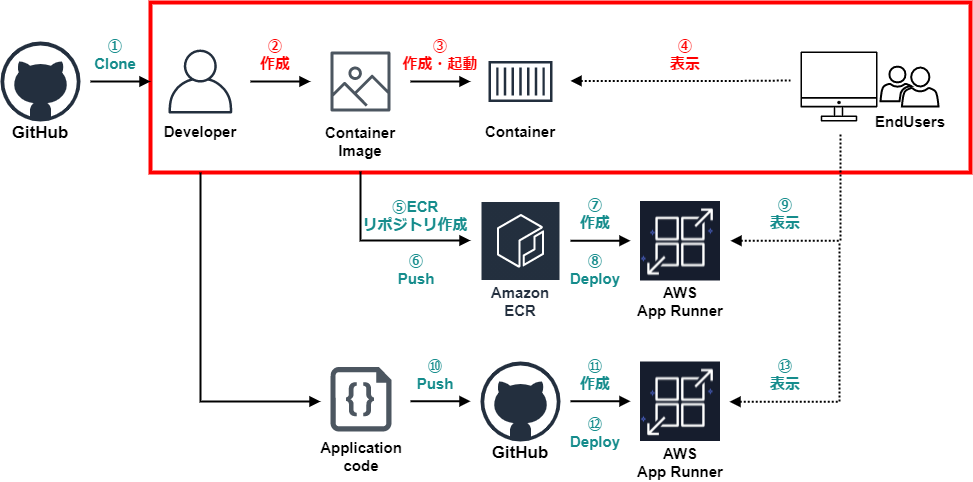
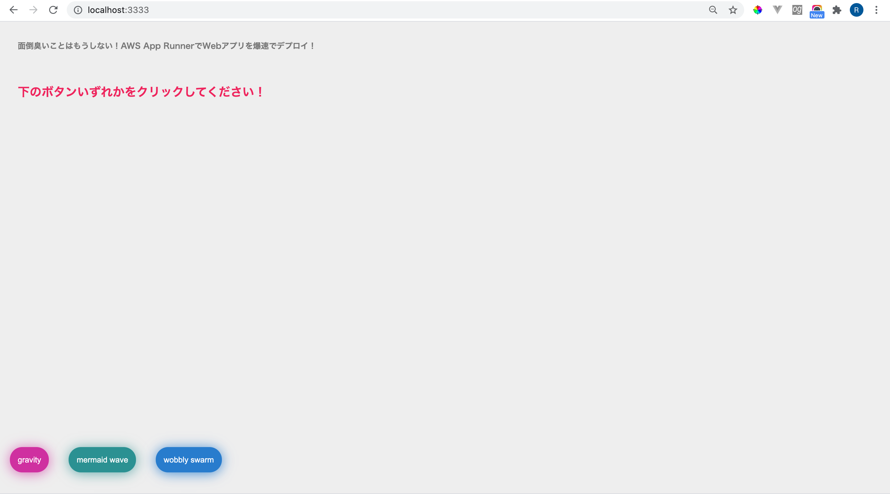

# デモアプリ動作確認
この手順では次の手順を進めていきます。  
  

## イメージ作成
meet-up-20_app-runnerフォルダに移動します。  
```
cd meet-up-20_app-runner
```

Dockerイメージのビルドします。  
```
docker build . -t app-runner-example
```

## コンテナの作成、起動
次のコマンドを実行し、ローカル環境でビルドしたイメージを実行します。  
```
docker run -p 3333:3333 -d app-runner-example
```

## アプリ確認
次のリンクよりデモアプリが動作しているか確認します。  
URL: http://localhost:3333  
※実際に動いていれば下記の画面が表示されます。  

