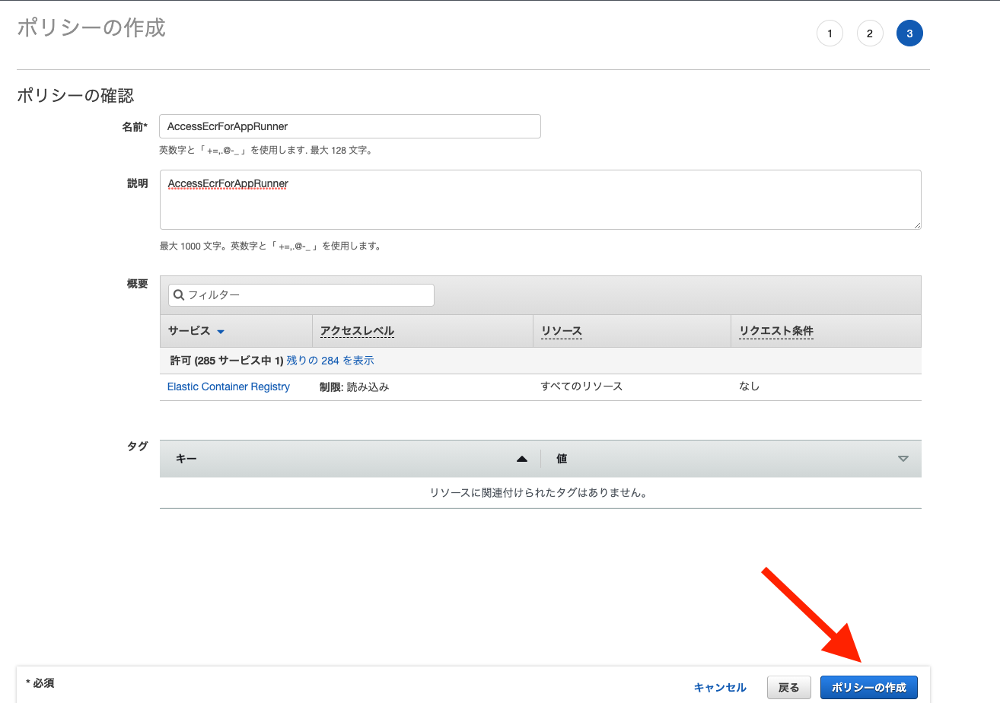
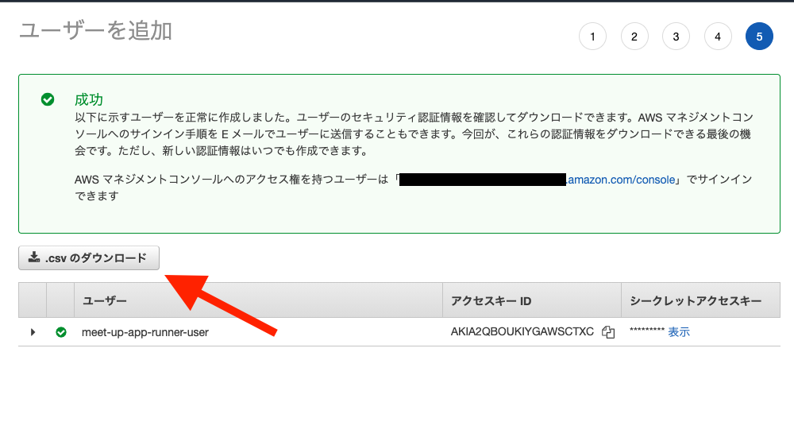

# コンテナレジストリパターン

この手順では序盤について、次の手順を進めていきます。  
  

今回はコンテナレジストリにECRを利用します。  

## ECRリポジトリ作成
AWSにログインし、検索欄から「ECR」と検索します。  
※次のリンクでも表示します。  
　[Amazon ECR Repositories](https://ap-northeast-1.console.aws.amazon.com/ecr/repositories?region=ap-northeast-1)  
  
リポジトリを作成ボタンをクリックします。 

**注意：リージョンが東京リージョンになっているかを確認してください。東京リージョン以外の場合はリージョンを東京に選択してください。**

リポジトリ名に`app-runner-example`と入力します。


## ECR用IAM User作成
ローカルからECRにpushするためのIAM Userを作成します。  

**注意**：すでに「AdministratorAccess」権限を持ち、プログラムのアクセスの権限のあるユーザーを作成されている場合は、このステップを飛ばしてください。


### ECR用ポリシー作成
IAMの画面に移動し、左メニューからポリシーを選択し、ポリシーを作成ボタンをクリックします。  


JSONを選択、下記をコピーし貼り付けてください。
```
{
    "Version": "2012-10-17",
    "Statement": [
        {
            "Effect": "Allow",
            "Action": [
                "ecr:*"
            ],
            "Resource": "*"
        }
    ]
}
```
貼り付け後、`次のステップ：タグ`ボタンをクリックします。


タグの設定は不要です。  
`次のステップ：確認`ボタンをクリックします。  
次の設定値を入力し、`ポリシーの作成`ボタンをクリックし、ポリシーを作成します。

> 名前： `AccessEcrForAppRunner`



### IAM User作成
左メニューからユーザーを選択し、`ユーザーを追加`ボタンをクリックします。


次の設定値を入力し、`次のステップ：アクセス制限`ボタンをクリックします。  

> ユーザー名： `meet-up-app-runner-user`  
> アクセスの種類： プログラムによるアクセスにチェックします。
  


`既存のポリシーを直接アタッチ`を選択し、「AccessEcrForAppRunner」にチェックを入れ、確認画面までスキップします。  


確認画面で`.csvのダウンロード`ボタンをクリックし、IAM Userの認証情報が記載されているCSVをダウンロードします。  



## Dockerイメージプッシュ
### AWS認証情報の設定
aws-cliを利用して、ECRにイメージをプッシュします。  
それに伴い、credentialsの設定を行います。  

```
# awsフォルダを作成
mkdir aws
```

---

先ほど、CSVでダウンロードしたIAM Userの認証情報(アクセスID,アクセスキー)を次のイコールの後に値を設定します。  

**Macの場合**
```
cat <<EOF > aws/credentials
[default]
aws_access_key_id = [Access key ID]
aws_secret_access_key = [Secret access key]
EOF
```

**Windowsの場合**
```
(
  echo [default]
  echo aws_access_key_id = [Access key ID]
  echo aws_secret_access_key = [Secret access key]
) >> aws/credentials
```

---

configの設定をします。  
**Macの場合**

```
cat <<EOF > aws/config
[default]
region = ap-northeast-1
output = json
EOF
```

**Windowsの場合**
```
(
  echo [default]
  echo region = ap-northeast-1
  echo output = json
) >> aws/config
```

---

ECR画面に移動し、プッシュコマンドを確認し、ECRにpushします。  
今回はAWS CLIをローカルにダウンロードせず、Dockerを通してAWS CLIコマンドを実行します。  

プッシュコマンドを確認します。  
後続のECRイメージプッシュ手順で利用します。  


**注意：Windowユーザーの方がプッシュコマンドを利用する際は、WindowsのプッシュコマンドではなくmacOS/Linuxのプッシュコマンドを使用してください。**


### ECRイメージプッシュ

 
1. AWS CLIでAWSにログインします。  
  **Macの場合**  
  例：`docker run --rm -ti -v $(pwd)/aws:/root/.aws -v $(pwd):/aws amazon/aws-cli ecr get-login-password --region ap-northeast-1 | docker login --username AWS --password-stdin 0000000000.dkr.ecr.ap-northeast-1.amazonaws.com`
  ```
  docker run --rm -ti -v $(pwd)/aws:/root/.aws -v $(pwd):/aws amazon/aws-cli [app-runner-exampleのプッシュコマンドの１をコピー（先頭のawsは省く）]
  ```
  **Windowsの場合**  
  例：`docker run --rm -ti -v %cd%/aws:/root/.aws -v %cd%:/aws amazon/aws-cli ecr get-login-password --region ap-northeast-1 | docker login --username AWS --password-stdin 0000000000.dkr.ecr.ap-northeast-1.amazonaws.com`
  ```
  docker run --rm -ti -v %cd%/aws:/root/.aws -v %cd%:/aws amazon/aws-cli [app-runner-exampleのプッシュコマンドの１をコピー（先頭のawsは省く）]
  ```

  ログインが成功すると次のメッセージが表示されます。  
  > Login Succeeded  
2. app-runner-exampleのプッシュコマンドの3を実行します。  
  例：`docker tag app-runner-example:latest 0000000000.dkr.ecr.ap-northeast-1.amazonaws.com/app-runner-example:latest`  
3. app-runner-exampleのプッシュコマンドの4を実行します。  
  例：`docker push 0000000000.dkr.ecr.ap-northeast-1.amazonaws.com/app-runner-example:latest`  
  プッシュコマンドが成功すると、次のメッセージが表示されます。  
  > The push refers to repository [0000000000.dkr.ecr.ap-northeast-1.amazonaws.com/app-runner-example]  
  > 00000d76f0b8: Pushed  
  > 00000cbf4ab0: Layer already exists  
  > ...  
  > latest: digest: sha256:97c0000000000... size: 3051  

## App Runnerデプロイ
AWSのApp Runnerの画面に移動し、App Runnerの設定、デプロイを行います。  
以降の手順では次の手順を進めていきます。  
  

### AppRunner作成
App Runnerの画面に移動します。
※次のリンクでも表示します。  
　[AWS App Runner](https://ap-northeast-1.console.aws.amazon.com/apprunner/home?region=ap-northeast-1#/welcome)  

App Runnerサービスを作成するボタンをクリックします。


#### App Runnerサービスの設定、デプロイを行行います。

##### コンテナイメージのURIは、先ほど作成したECRリポジトリを選択します。


##### サービスを設定します。


##### 作成とデプロイボタンをクリックします。


### デプロイ内容確認
デプロイが完了後、App Runner画面の公開されたURLにアクセスし、アプリが動いているかを確認します。  
  

アプリが問題なく動作している場合、下記の画面が表示されます。  
  
