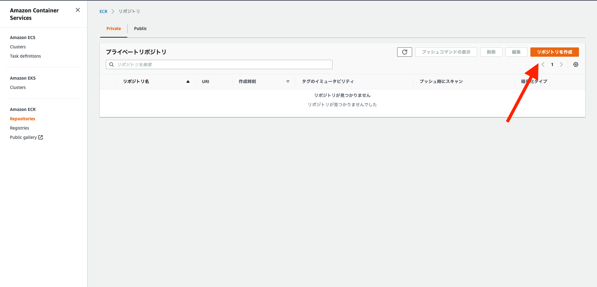
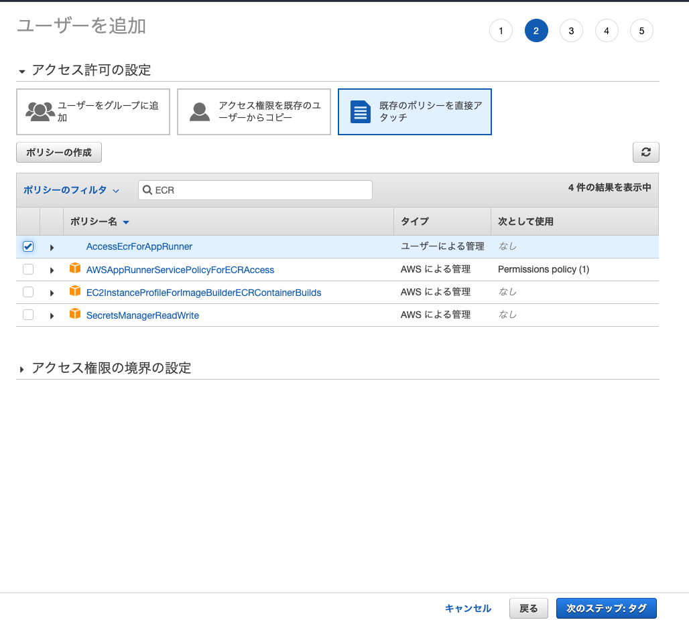

# コンテナレジストリパターン

今回はコンテナレジストリにECRを利用します。  

## ECRリポジトリ作成
AWSにログインし、検索欄から「ECR」と検索します。  
  
リポジトリを作成ボタンをクリックします。  

リポジトリ名に`app-runner-example`と入力します。


## ECR用IAM User作成
ローカルからECRにpushするためのIAM Userを作成します。  

**注意**：すでに「AdministratorAccess」権限を持ち、プログラムのアクセスの権限のあるユーザーを作成されている場合は、このステップを飛ばしてください。


### ECR用ポリシー作成
IAMの画面に移動し、左メニューからポリシーを選択し、ポリシーを作成ボタンをクリックします。  


JSONを選択、下記をコピーし貼り付けてください。
```
{
    "Version": "2012-10-17",
    "Statement": [
        {
            "Effect": "Allow",
            "Action": [
                "ecr:*"
            ],
            "Resource": "*"
        }
    ]
}
```
貼り付け後、`次のステップ：タグ`ボタンをクリックします。


次の設定値を入力し、`ポリシーの作成`ボタンをクリックし、ポリシーを作成します。

> 名前： `AccessEcrForAppRunner`


### IAM User作成
左メニューからユーザーを選択し、`ユーザーを追加`ボタンをクリックします。


次の設定値を入力し、`次のステップ：アクセス制限`ボタンをクリックします。  

> ユーザー名： `meet-up-app-runner-user`  
> アクセスの種類： プログラムによるアクセスにチェックします。
  


`既存のポリシーを直接アタッチ`を選択し、「AccessEcrForAppRunner」にチェックを入れ、確認画面までスキップします。  


確認画面で`.csvのダウンロード`ボタンをクリックし、IAM Userの認証情報が記載されているCSVをダウンロードします。  


## Dockerイメージプッシュ
### AWS認証情報の設定
aws-cliを利用して、ECRにイメージをプッシュします。  
それに伴い、credentialsの設定を行います。
```
# .awsに移動
~/Desktop/meet-up-20_app-runner $ cd ~/.aws
# credentialsを作成、修正
.aws $ vi credentials
```
先ほど、CSVでダウンロードしたIAM Userの認証情報(アクセスID,アクセスキー)を次のイコールの後に値を設定します。  
```
[default]
aws_access_key_id = 
aws_secret_access_key = 
```
※設定後は esc -> :wp -> Enter の順番でキーボードを打ち、保存してください。

configの設定をします。
```
.aws $ vi config
```
次の形式で設定します。
```
[default]
region = ap-northeast-1
output = json
```
※設定後は esc -> :wp -> Enter の順番でキーボードを打ち、保存してください。

ECR画面に移動し、プッシュコマンドを確認し、ECRにpushします。  
今回はAWS CLIをローカルにダウンロードせず、Dockerを通してAWS　CLIコマンドを実行します。  
Dockerを通してAWS CLIコマンドを実行する際は下記コマンドをベースに実行します。
```
docker run --rm -ti -v ~/.aws:/root/.aws -v $(pwd):/aws amazon/aws-cli [AWSコマンド]
```
プッシュコマンドを確認します。  


### ECRイメージプッシュ
```
# クローンしてきたフォルダに移動
cd ~/Desktop/meet-up-20_app-runner
# ログインする（ログインが成功すると「Login Succeeded」が表示される）
docker run --rm -ti -v ~/.aws:/root/.aws -v $(pwd):/aws amazon/aws-cli [app-runner-exampleのプッシュコマンドの１をコピー（先頭のawsは省く）]
例：　docker run --rm -ti -v ~/.aws:/root/.aws -v $(pwd):/aws amazon/aws-cli ecr get-login-password --region ap-northeast-1 | docker login --username AWS --password-stdin 0000000000.dkr.ecr.ap-northeast-1.amazonaws.com
# app-runner-exampleのプッシュコマンドの3を実行
例： docker tag app-runner-example:latest 0000000000.dkr.ecr.ap-northeast-1.amazonaws.com/app-runner-example:latest
# app-runner-exampleのプッシュコマンドの4を実行
例： docker push 0000000000.dkr.ecr.ap-northeast-1.amazonaws.com/app-runner-example:latest
```
