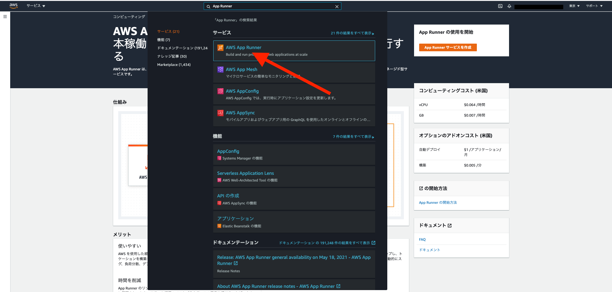
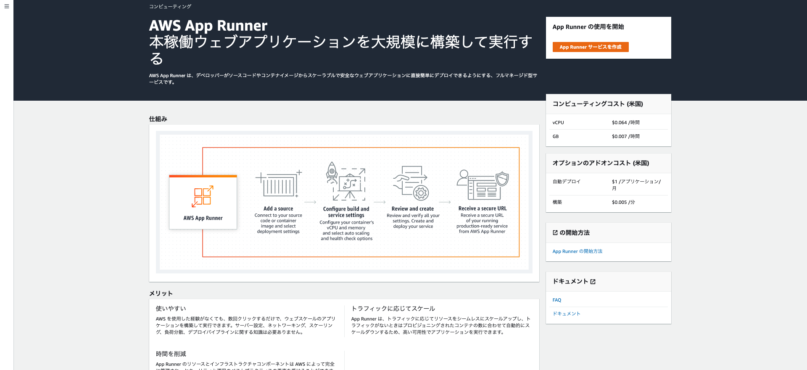
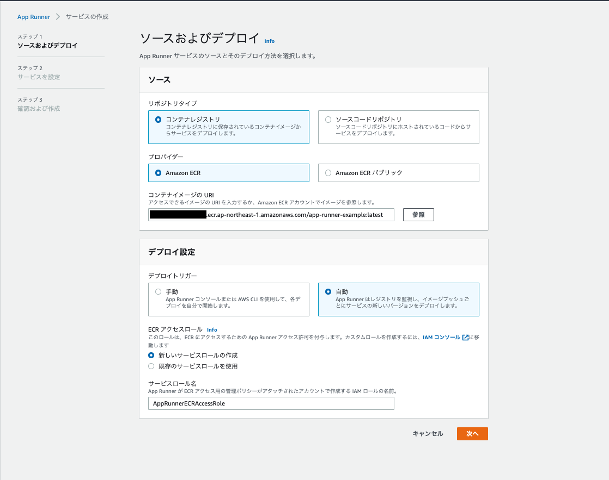
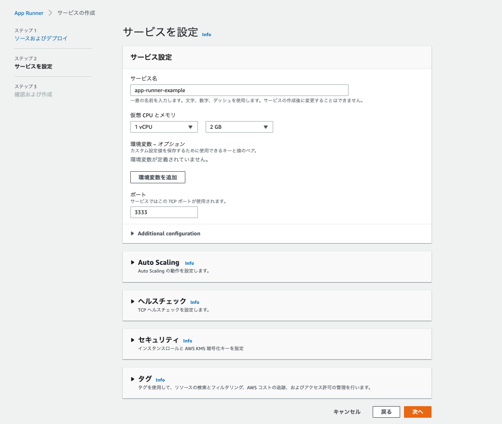
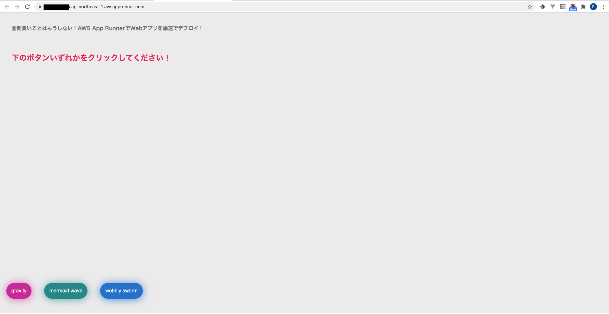

# App Runnerデプロイ
AWSのApp Runnerの画面に移動し、App Runnerの設定、デプロイを行います。

## AppRunner作成
App Runnerの画面に移動します。

App Runnerサービスを作成するボタンをクリックします。

#### -2 App Runnerサービスの設定、デプロイを行う
##### コンテナイメージのURIは、先ほど作成したECRリポジトリを選択する

##### サービスを設定する

##### 作成とデプロイボタンをクリック

### デプロイ内容確認
デプロイが完了後、App Runner画面の公開されたURLにアクセスし、アプリが動いているかを確認します。  
  

アプリが問題なく動作している場合、下記の画面が表示されます。  
  
