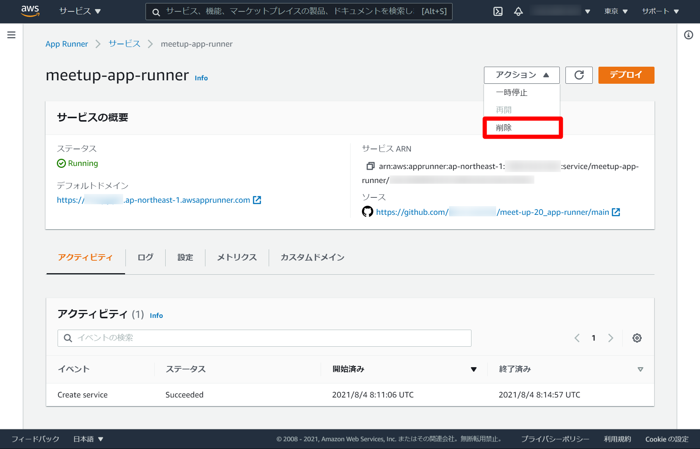
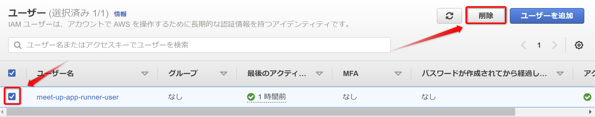
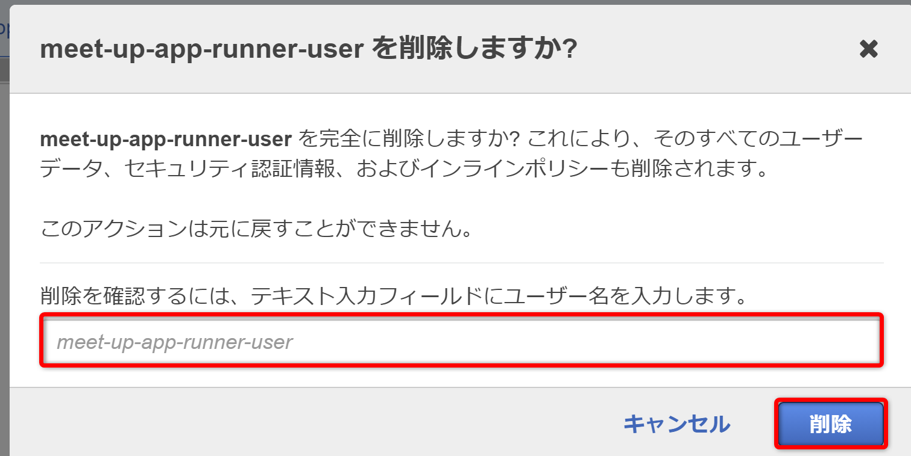
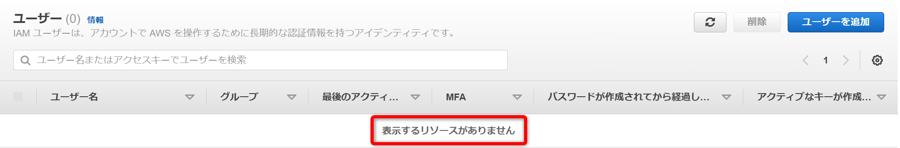
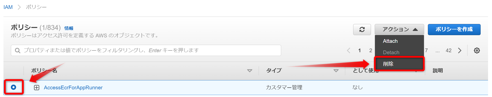
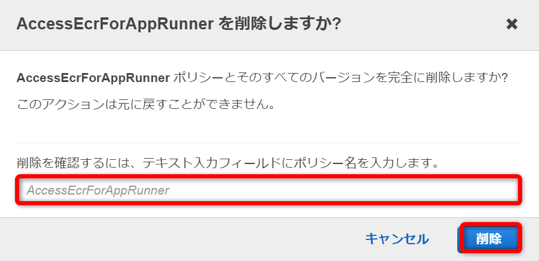
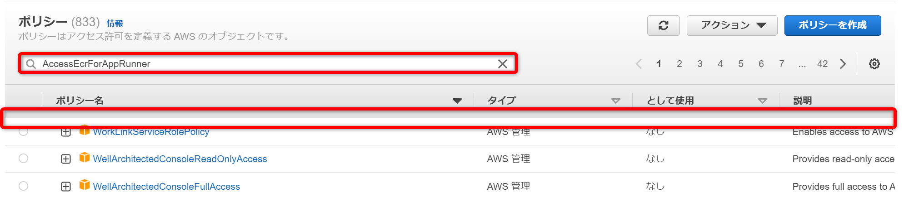

# ゴミ掃除

## App Runnerサービス削除
次のリンクよりApp Runnerサービス一覧を表示します。  
[App Runnerサービス一覧](https://ap-northeast-1.console.aws.amazon.com/apprunner/home?region=ap-northeast-1#/services)  
  

画面に表示されている指示通り、入力欄に`delete`を入力し、`削除`ボタンをクリックします。  
  

本日作成したサービスが削除されていることを確認します。


## IAM削除

### IAMユーザー削除

次のリンクよりIAMユーザー一覧を表示します。  
[IAMユーザー](https://console.aws.amazon.com/iamv2/home#/users)  

今回作成したユーザーを選択し、`削除`ボタンをクリックします。  
  

画面に表示されている指示通り、入力欄に`meet-up-app-runner-user`を入力し、`削除`ボタンをクリックします。  
  

対象のユーザーが削除されていることを確認します。  
  

### IAMポリシー削除

次のリンクよりIAMポリシー一覧を表示します。  
[IAMポリシー](https://console.aws.amazon.com/iamv2/home?#/policies)  

作成したIAMポリシーを選択し、`アクション`ボタンのドロップダウンより`削除`ボタンをクリックします。  
  

画面に表示されている指示通り、入力欄に`AccessEcrForAppRunner `を入力し、`削除`ボタンをクリックします。  
  

検索欄に`AccessEcrForAppRunner`を入力し、対象のポリシーが削除されていることを確認します。  
  

## ローカルに構築したDockerイメージ削除

次のコマンドを実行し、コンテナ状態を確認します。  
```
docker ps
---
CONTAINER ID   IMAGE                COMMAND                  CREATED          STATUS          PORTS                                       NAMES
e572bd192f8d   app-runner-example   "docker-entrypoint.s…"   00 seconds ago   Up 00 seconds   0.0.0.0:3333->3333/tcp, :::3333->3333/tcp   nice_kare
```

上記で実行した`CONTAINER ID`を次のコマンドで利用します。  
起動中のコンテナを停止します。  
```
docker stop [CONTAINER ID]
```

ビルドして作成したコンテナイメージを削除します。  
```
docker rmi -f app-runner-example
```

次のメッセージが表示されれば、成功です。  
> Untagged: 000000.dkr.ecr.ap-northeast-1.amazonaws.com/app-runner-example...  

ECRにプッシュしたイメージを削除します。  
コンテナ名は次の手順で利用した`000000000000.dkr.ecr.ap-northeast-1.amazonaws.com/app-runner-example`を入力してください。
```
docker rmi -f [コンテナ名]
```

次のメッセージが表示されれば、成功です。  
> Untagged: 000000.dkr.ecr.ap-northeast-1.amazonaws.com/app-runner-example...  
> Deleted: sha256:f382b74e...  

以上。
