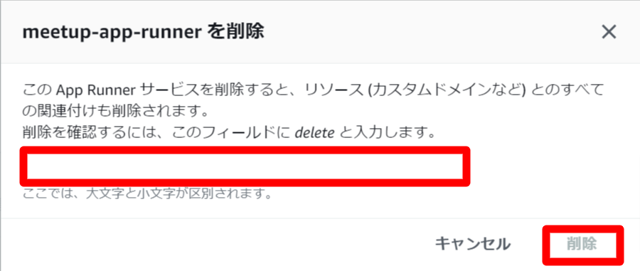
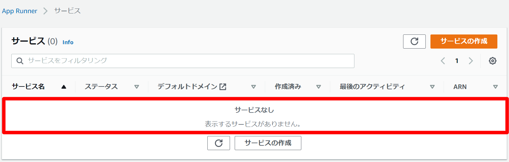

# ゴミ掃除

次のリンクよりApp Runnerサービス一覧画面を表示します。  
[App Runnerサービス一覧](https://ap-northeast-1.console.aws.amazon.com/apprunner/home?region=ap-northeast-1#/services)  
  

画面に表示されている指示通り、入力欄に`delete`を入力し、`削除`ボタンをクリックします。  
  

本日作成したサービスが削除されていることを確認します。

以上。